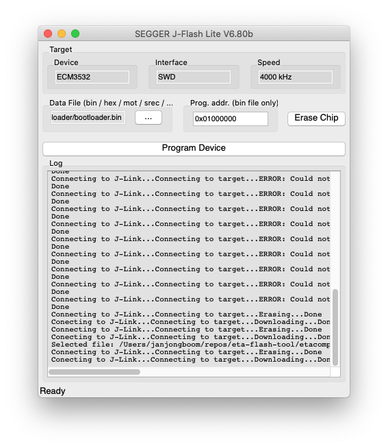

# Edge Impulse firmware for Eta Compute ECM3532 AI Sensor / AI Vision

Edge Impulse enables developers to create the next generation of intelligent device solutions with embedded Machine Learning. This repository contains the Edge Impulse firmware for the Eta Compute ECM3532 AI Sensor and AI Vision development boards. This device supports all Edge Impulse device features, including ingestion, remote management and inferencing.

> **Note:** Do you just want to use this development board with Edge Impulse? No need to build this firmware. See the instructions [here](https://docs.edgeimpulse.com/docs/eta-compute-ecm3532-ai-sensor) for a prebuilt image and instructions. Or, you can use the [data forwarder](https://docs.edgeimpulse.com/docs/cli-data-forwarder) to capture data from any sensor.

## Requirements

### Hardware

* [Eta Compute ECM3532 AI Sensor](https://etacompute.com/products/) or [Eta Compute ECM3532 AI Vision](https://etacompute.com/products/) development board.
* [Sparkfun FTDI Basic Breakout](https://www.sparkfun.com/products/9873) breakout board, or a similar FTDI to USB board that supports 3.3V - the development boards are not 5V tolerant.

### Software

* [Node.js 12](https://nodejs.org/en/download/) or higher.
* [Python 3](https://www.python.org/download/releases/3.0/).
* [CMake](https://cmake.org) version 3.12.1 or higher.
* [GNU Make](https://www.gnu.org/software/make/).
* [GNU ARM Embedded Toolchain 8-2018-q4-major](https://developer.arm.com/tools-and-software/open-source-software/developer-tools/gnu-toolchain/gnu-rm/downloads) - make sure `arm-none-eabi-gcc` is in your PATH.
* [Edge Impulse CLI](https://docs.edgeimpulse.com/docs/cli-installation).

    You can install this via npm:

    ```
    $ npm install edge-impulse-cli@latest -g
    ```

## Building the application

1. Your development board should already have the bootloader present. If this is not the case:
    * Grab [bootloader/bootloader.bin](bootloader/bootloader.bin).
    * Connect a J-Link to J2.
    * Open JFlashLite (in the [JLink software and documentation pack](https://www.segger.com/downloads/jlink/)) and flash the bootloader to address `0x01000000`.

        

1. Build the Edge Impulse firmware:

    **AI Sensor board**

    ```
    $ cd Applications/edge-impulse-standalone
    $ mkdir build
    $ cd build
    $ cmake ..
    $ make loadconfig CONFIG="../ai-sensor-boot-config"
    $ make -j
    ```

    **AI Vision board**

    ```
    $ cd Applications/edge-impulse-standalone
    $ mkdir build
    $ cd build
    $ cmake ..
    $ make loadconfig CONFIG="../ai-vision-boot-config"
    $ make -j
    ```

    The configuration file you pick, during the `make loadconfig` step depends on the target and flashing method (either with or without bootloader). See Configuration files chapter for more info.

1. To flash your application:

    Using the bootloader:

    ```
    $ make flash_bl
    ```

    Using a JLink:

    ```
    $ make flash
    ```

## Configuration files

The project can build a firmware binary for either the Eta Compute AI Sensor board or the Eta Compute Vision board, depending on the loaded configuration file.

Apart from the different targets, you can also select between between binary for bootloader upload or uploading using a programmer (JLink).
As in the previous paragraph, the config is loaded with the command:

```
    $ make loadconfig CONFIG="../ai-sensor-boot-config"
```

The available configurations are:

* ai-sensor-config - AI Sensor without bootloader offset.
* ai-sensor-boot-config - AI Sensor with bootloader offset.
* ai-vision-config - AI Vision without bootloader offset.
* ai-vision-boot-config - AI Vision with bootloader offset.

## Inference over Bluetooth

Classification output can be send over Uart BLE. Both boards have the Abov A31R118 Bluetooth processor which advertises as a Uart over BLE device with the name `aBLE UART`. Once connected you can start and stop inference with the usual commands: `AT+RUNIMPULSE` to start, `b` to stop.

To build for the Vision board, use one of these configuration files:
* ai-vision-ble-config
* ai-vision-ble-boot-config
* ai-sensor-ble-config
* ai-sensor-ble-boot-config

## License

This repository contains code from the Eta Compute TensaiFlow SDK Alpa v2-0.2, which is licensed under the Apache 2.0 license.
